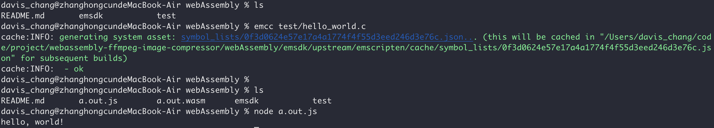
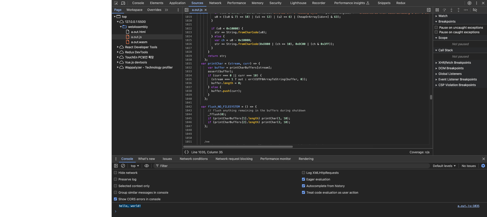
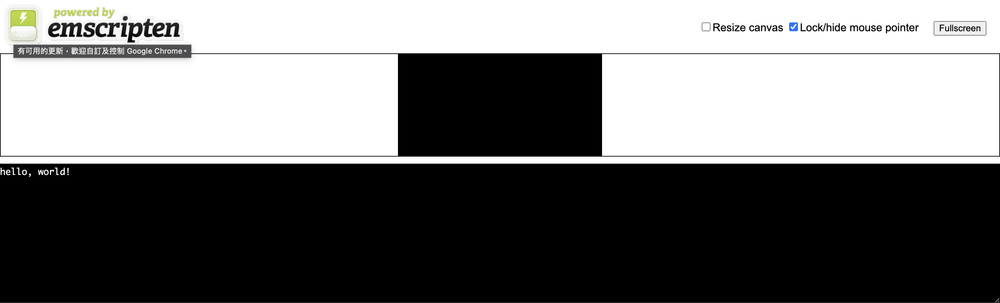

# WebAssembly and emscripten


## Installation instructions using the emsdk (recommended)

- The core Emscripten SDK (emsdk) driver is a Python script. You can get it for the first time with
- Run the following emsdk commands to get the latest tools from GitHub and set them as active


```bash
# Get the emsdk repo
git clone https://github.com/emscripten-core/emsdk.git

# Enter that directory
cd emsdk

# Fetch the latest version of the emsdk (not needed the first time you clone)
git pull

# Download and install the latest SDK tools.
./emsdk install latest

# Make the "latest" SDK "active" for the current user. (writes .emscripten file)
./emsdk activate latest

# Activate PATH and other environment variables in the current terminal
source ./emsdk_env.sh

# Verifying Emscripten
emcc -v
```

## Running Emscripten

First, let us compile file test/hello_world.c. W

```bash
emcc test/hello_world.c

```

You should see two files generated by that command: a.out.js and a.out.wasm.
And you can run them using node.js.




Add a.out.js into a static html file.

```html
<!DOCTYPE html>
<html lang="en">
  <head>
    <meta charset="UTF-8">
    <meta name="viewport" content="width=device-width, initial-scale=1.0">
    <title>Hello WebAssembly and emscripten</title>
  </head>
  <body>
    <script src="a.out.js"></script>
  </body>
</html>
```




## Generating HTML
You’ll need to serve the files using a local webserver and then open http://localhost:5500/hello.html (vscode)

```bash
emcc test/hello_world.c -o hello.html
emcc test/hello_world_sdl.c -o hello-sdl.html
```


