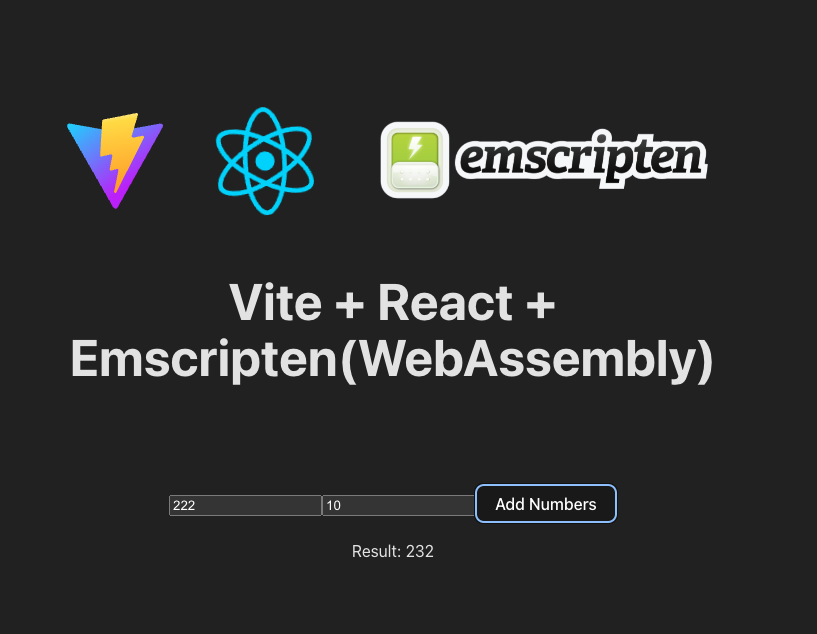

# React + TypeScript + Vite + + Emscripten(WebAssembly)

This template provides a minimal setup to get React working in Vite with HMR and some ESLint rules.


```bash
npm i
npm run dev
```


## Running Emscripten

After compiling the add_number.c file, add your add_number.wasm file into the /wasm folder.

```bash
// add_number.wasm
emcc test/add_number.c -o add_number.js

```

## Use .wasm file
Implementation of a singleton class in JavaScript that can be used to load and reuse the WebAssembly instance.

```ts
interface WasmExports extends WebAssembly.Exports {
  // Example addNumber method, modify as needed
  addNumber: (a: number, b: number) => number;
}

class WebAssemblyLoader {
  private static instance: WebAssemblyLoader | null = null;
  private wasmInstance: WebAssembly.Instance | null = null;
  private wasmUrl: string;

  private constructor(wasmUrl: string) {
    this.wasmUrl = wasmUrl;
  }

  public static getInstance(wasmUrl: string): WebAssemblyLoader {
    if (!WebAssemblyLoader.instance) {
      WebAssemblyLoader.instance = new WebAssemblyLoader(wasmUrl);
    }
    return WebAssemblyLoader.instance;
  }

  public async loadWasm(): Promise<
    WebAssembly.Instance & { exports: WasmExports }
  > {
    if (!this.wasmInstance) {
      const response = await fetch(this.wasmUrl);
      const { instance } = await WebAssembly.instantiateStreaming(response);
      this.wasmInstance = instance;
    }
    return this.wasmInstance as WebAssembly.Instance & { exports: WasmExports };
  }
}

export default WebAssemblyLoader;

```


```tsx

// https://vitejs.dev/guide/features.html#webassembly
import wasmUrl from "./wasm/add_number.wasm?url";
import WebAssemblyLoader from "./library/WebAssemblyLoader";

function App() {
  const [numbers, setNumbers] = useState({ a: 20, b: 10 });
  const [result, setResult] = useState(0);

  const wasmLoader = WebAssemblyLoader.getInstance(wasmUrl);
  console.log("wasmLoader:", wasmLoader);

  const handleClick = (e: React.MouseEvent<HTMLButtonElement>) => {
    e.preventDefault();

    wasmLoader.loadWasm().then((instance) => {
      const sum = instance.exports.addNumber(numbers.a, numbers.b);
      setResult(sum);
    });
  };

  ...
  ...

```


